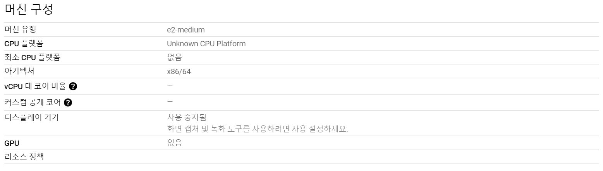
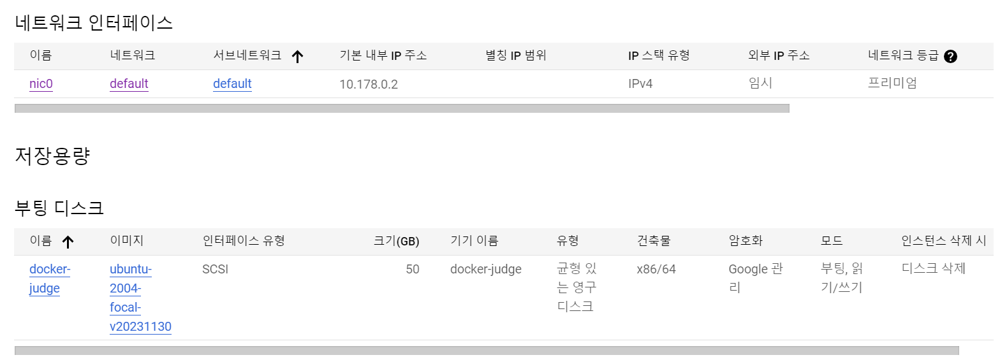
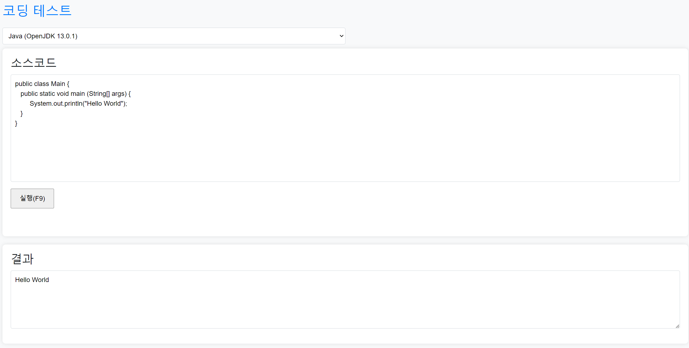

## 목차
- [목차](#목차)
- [프로젝트 개요](#프로젝트-개요)
- [주요 기능](#주요-기능)
- [프로젝트 목표](#프로젝트-목표)
- [기술 스택](#기술-스택)
  - [Google Cloud Platform](#google-cloud-platform)
  - [Apache](#apache)
  - [docker](#docker)
  - [javascript](#javascript)
- [프로젝트 결론](#프로젝트-결론)
- [프로젝트 문제점](#프로젝트-문제점)

<br>
<br>

## 프로젝트 개요
온라인 코드 실행 시스템은 간단한 코드를 테스트 해보고 코드가 올바르게 작동하는지 확인해 볼 수 있는 기능을 제공하기 위해 구현하였습니다.

## 주요 기능
- 사용자가 웹 페이지에 코드를 작성할 수 있는 기능
- 사용자가 작성한 코드를 judge0 서버에 전송하여 응답받은 결과 값 보여주는 기능

## 프로젝트 목표
온라인 코드 실행 시스템은 온라인 상에서 다양한 프로그래밍 언어로 작성된 코드를 실행하고 결과를 보여주는 기능을 제공하는 것이 목표입니다.

## 기술 스택


온라인 코드 실행 시스템은 Google Cloud Platform의 가상 머신을 이용하여 구현하였고 가상 머신에서 도커로 judge0 서버를 구현하고 웹서버를 apache2로 구현하여 VM 안에서 judge0 서버와 웹 서버의 통신으로 구현된다.

사용자가 웹페이지에 입력한 코드를 javascript 언어로 judge0 서버로 전달한 후 응답 받은 결과 값을 사용자에게 보여준다. 

<br>
<br>
<br>

***
### Google Cloud Platform
가상 머신에서의 도커, 웹서버 구현을 위해 GCP VM 환경에서 프로젝트를 진행 하였습니다. 

<br>

가상 머신 구성, 방화벽, 네트워크 인터페이스 설정, 부팅 디스크 설정은 다음과 같이 설정 했습니다.




### Apache
GCE 웹 서버는 Apache를 이용해 구현하였습니다.

```
sudo su
apt install apache2
service apache2 start
```


### docker
GCE에서 도커를 설치한 후 사용자를 docker 그룹에 추가하여 root 권한 없이 docker 명령을 실행 할 수 있도록 합니다.

```
$ curl -s https://get.docker.com/ | sudo sh
$ sudo usermod -aG docker $USER 
```

judge0의 docker-compose.yml 파일을 설정파일로 실행하기 위해 docker-compose를 설치해줍니다.

```
$ sudo apt-get update
$ sudo apt-get install docker-compose-plugin 
$ sudo apt-get install unzip
$ docker compose version
```

judge0-v1.13.0 압축파일을 다운로드 한후 압축해제 하고 judge0의 서비스를 실행합니다.

```
$ wget https://github.com/judge0/judge0/releases/download/v1.13.0/judge0-v1.13.0.zip
$ unzip judge0-v1.13.0.zip

$ cd judge0-v1.13.0
$ docker-compose up -d db redis
$ sleep 10s
$ docker-compose up -d
$ sleep 5s
```

### javascript
```html
<form name="input" method="post">
    <h3>소스코드</h3>
    <textarea id="code_area" cols="100" rows="10" style="resize:none"></textarea><br>

    <input type="button" value="실행" onclick="submitCode()" /><br><br><br>
</form>
<form name="output">
    <h3>결과</h3>
    <!-- <div id="print_area"></div><br> -->
    <textarea id="print_area" cols="50" rows="5" readonly></textarea><br>
</form>
<!-- <div id="response-container"></div> -->
```

form 태그를 이용하여 사용자가 코드를 입력할 textarea와 결과를 보여줄 textarea에 id값을 지정해줍니다.

```html
<select id="select" name="select">
    <option value="45">Assembly (NASM 2.14.02)</option>
    <option value="46">Bash (5.0.0)</option>
    <option value="50">C (GCC 9.2.0)</option>
    <option value="51">C# (Mono 6.6.0.161)</option>
    <option value="54">C++ (GCC 9.2.0)</option>
    <option value="62">Java (OpenJDK 13.0.1)</option>
    <option value="63">JavaScript (Node.js 12.14.0)</option>
    <option value="71">Python (3.8.1)</option>
    <option value="82">SQL (SQLite 3.27.2)</option>
    <option value="74">TypeScript (3.7.4)</option>
</select>
```

사용자가 언어를 선택 하였을 때의 id도 지정해줍니다.

```javascript
async function submitCode() {
    try {
        var Code_Area = document.getElementById('code_area').value;
        var Select_Value = document.getElementById('select').value;

        const response = await fetch("http://34.64.34.227:2358/submissions/?base64_encode=true&wait=true", {
            method: "POST",
            headers: {
                'Content-Type': 'application/json',
            },
            body: JSON.stringify({
                source_code: Code_Area,
                language_id: Select_Value
            })
        });
        const data = await response.json();

        // displayResponse(data);

        var Print_Code = document.getElementById('print_area');
        if (data.stdout) {
            Print_Code.value = data.stdout;
        } else if (data.stderr) {
            Print_Code.value = data.stderr;
        } else {
            Print_Code.value = '?';
        }
    } catch (error) {
        console.error('Error:', error);
    }
}
```

사용자가 실행 버튼을 누르면 judge0에 fetch를 이용해서 사용자가 선택한 언어와 코드를 보낸후 결과를 응답으로 받아와 결과 값을 보여주게 됩니다.

## 프로젝트 결론

처음 구현하려던 바와 같이 언어를 선택하고 코드를 입력하면 다음과 같이 정상적으로 결과 값을 받아오는 것을 볼 수 있습니다.  
GCP VM에서의 서버간의 통신에 대해 더 명확히 알 수 있었고 구글 클라우드 가상 머신 환경에서의 개발 방식에 대해서 제대로 이해할 수 있었습니다.

## 프로젝트 문제점
프로젝트를 진행하는 과정 중에 GCP 클라우드의 VPC 방화벽 정책에서 http허용 포트를 80번 포트만 허용하여 Apache 웹서버만 동작하고 웹서버와 judge0 서버가 서로 통신하는 못하여 컴파일 된 코드를 받아오지 못하는 문제가 발생하여 도커로 judge0을 생성할 때 지정한 2358번 포트도 http 포트를 허용해주어 문제를 해결했습니다.  
문제를 해결해보며 GCP VM에서의 통신 방식에 대해서 더 명확하게 파악하고 이해할 수 있었고 VM환경에서의 개발에 대한 지식을 더 쌓게 되었습니다.